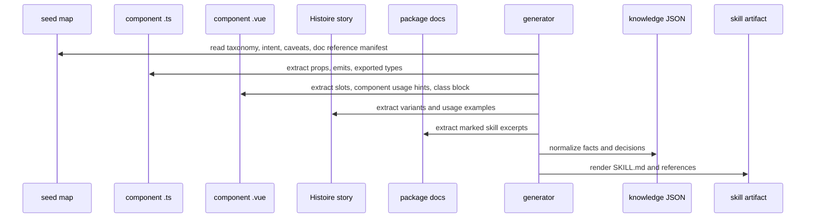

# Generation Workflow

## Pipeline



## Intermediate model

Generate a machine-readable model before rendering Markdown.

Candidate shape:

```ts
type PackageSkillModel = {
  packageName: string
  packageVersion: string
  skillName: string
  components: ComponentKnowledge[]
  categories: CategoryKnowledge[]
  skillReferences: SkillReference[]
  rules: UsageRule[]
  recipes: CompositionRecipe[]
}

type SkillReference = {
  source: string
  target: string
  description: string
  content: string
}

type ComponentKnowledge = {
  name: string
  category: string
  intent: string[]
  preferWhen: string[]
  avoidWhen: string[]
  sourceFiles: string[]
  props: PropKnowledge[]
  slots: SlotKnowledge[]
  events: EventKnowledge[]
  storyVariants: string[]
  examples: ExampleKnowledge[]
  composeWith: string[]
  caveats: string[]
}
```

## Extraction strategy

Use deterministic extraction where practical:

```
TypeScript AST:
  exported types
  props object names
  emits object names
  literal union values

Vue SFC parsing or conservative regex:
  defineSlots or slot usage
  component root class names
  aria and role markers

Story regex:
  <Story title="" group="">
  <Variant title="">
  imported package components
  @pu-story-covers markers
  compact example snippets

Markdown heading parsing:
  durable docs with <!-- agent-skill:start --> and <!-- agent-skill:end -->
  local evidence references
```

## Rendering strategy

Render in this order:

```
1. SKILL.md
2. references/component-map.md
3. references/composition-recipes.md
4. references copied from skillReferences
5. references/usage-rules.md
6. references/components/*.md
6. optional _artifacts/model.json for validation only
```

If TanStack Intent artifacts are adopted, generated intermediate files that
should not publish must be excluded from package files.

## Error behavior

The generator should fail on:

```
missing seed entry for public component
unknown seed category
duplicate component name
invalid skill frontmatter
missing required root references
skillReferences source without agent-skill excerpt markers
```

The generator should warn on:

```
component without story
story group mismatch
component without extracted props
component without examples
seed primary prop not found in source
legacy API caveat missing for known divergent component
```

## Manual review points

Automation can extract facts. Humans should own:

```
component intent
prefer/avoid rules
composition recipes
anti-patterns
durable doc content behind skillReferences
whether a generated example is truly canonical
distribution and install policy
```
