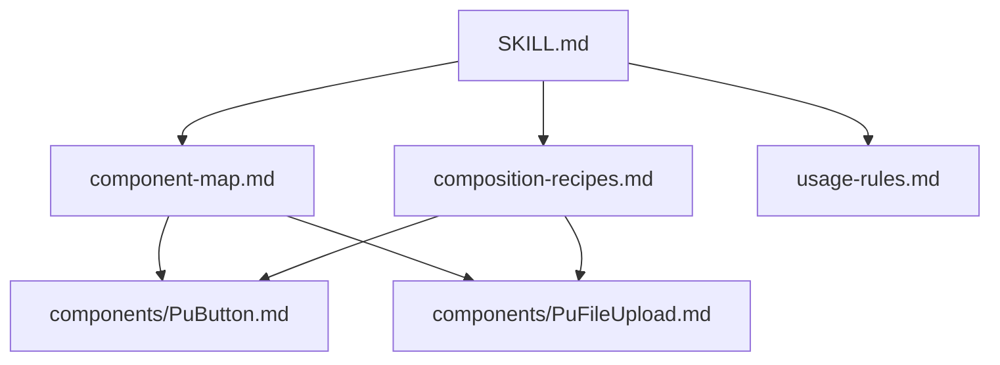
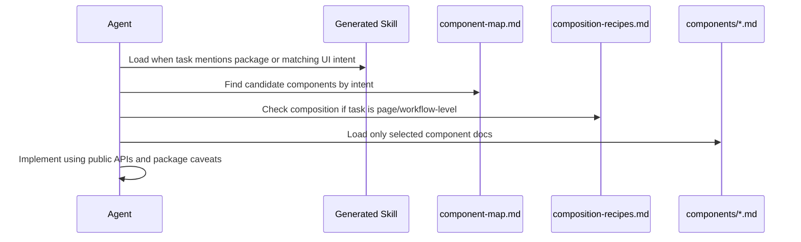

# Skill IA Draft

## Role

Generated skill role:

```
Teach downstream AI agents how to use @partner-up-dev/design-web components in
Vue application UI.
```

The skill should activate when the user asks to:

```
build UI using PartnerUp design components
choose components from @partner-up-dev/design-web
replace custom markup with package components
implement forms, page headers, empty states, overlays, file upload, or content
presentation in a project that depends on @partner-up-dev/design-web
```

## Generated skill topology



## SKILL.md responsibilities

The generated `SKILL.md` should stay compact.

It should contain:

```
package identity
when to use this skill
quick component-selection workflow
top-level intent map
import and registration basics
rules for using references
hard guardrails and common mistakes
```

It should not contain:

```
full prop tables for every component
long story examples
all design rationale
package maintenance instructions
```

## References

Generated references should use progressive disclosure:

```text
references/
  component-map.md
    Intent-to-component index.

  composition-recipes.md
    Page and workflow-level component combinations.

  usage-rules.md
    Cross-component consumer rules and package-specific caveats.

  components/
    PuExample.md
      Component-specific API, usage, story variants, caveats, and examples.
```

## Consumer workflow



## Decision order

The skill should tell the agent to decide in this order:

```
1. Identify the UI intent.
2. Check the component map for matching package components.
3. Prefer existing package components over custom markup.
4. For page-level UI, check composition recipes before selecting isolated
   components.
5. Load component-specific references only for selected components.
6. Use actual extracted public API, not generic library memory.
7. Preserve package caveats such as legacy prop names.
```

## Boundary examples

In scope:

```
Use PuEmptyState for an empty search result.
Use PuDescriptionList and PuDescriptionItem for grouped metadata.
Use PuFileUpload for file collection.
Use PuModal for blocking confirmation.
```

Out of scope:

```
Create a new PuUploadCard component.
Edit the package registry.
Refactor package SCSS variables.
Reorganize Histoire stories.
```

