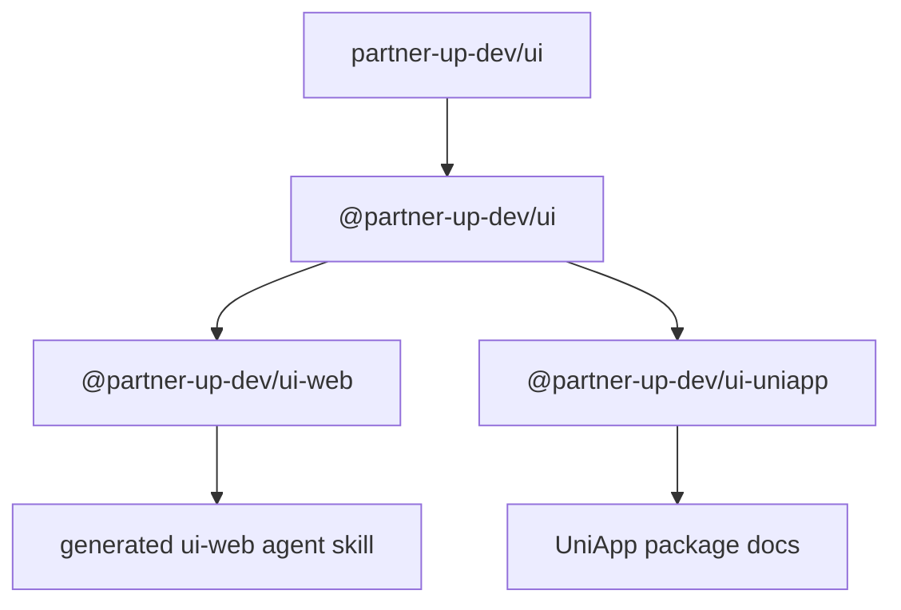

# PartnerUp UI Rename Task Packet

Status:

```text
Implemented. Repository rename and local remote URL update completed.
```

## Purpose

Rename this workspace from `design` to `ui` so the repository and package
identity match the consumer-facing positioning more directly.

The rename should make install names, repository identity, generated agent
references, and local development names clearer, while preserving correct
domain language for design-system concepts such as design tokens, design
style foundations, and component design guidance.

## Target State

```text
GitHub repository: partner-up-dev/ui
Private root package: @partner-up-dev/ui
Web package: @partner-up-dev/ui-web
UniApp package: @partner-up-dev/ui-uniapp
```

The package remains a multi-platform UI system workspace:



## Operating Constraint

Do not implement this rename until the user explicitly says to start.

Task packet creation and read-only exploration are allowed. Source, config,
release metadata, generated docs, Git remote, GitHub repository, and local
directory changes require an explicit start signal.

Do not create a new branch unless the user explicitly asks for one.

## Scope

In scope:

- GitHub repository rename from `partner-up-dev/design` to `partner-up-dev/ui`.
- Local Git remote URL update after the GitHub repository rename.
- Root package name and workspace scripts.
- Published package names:
  - `@partner-up-dev/design-web` to `@partner-up-dev/ui-web`
  - `@partner-up-dev/design-uniapp` to `@partner-up-dev/ui-uniapp`
- Package repository metadata.
- README, CONTRIBUTING, AGENTS, SVC docs, deployment docs, package docs, and
  migration docs.
- Generated web package skill name, display name, seed data, and references.
- Development server names where they represent package identity, such as
  `design-web` routes and portless names.
- Verification commands and task documentation.

Out of scope unless explicitly added:

- Component prefixes such as `PuButton`.
- Package directory names `packages/web` and `packages/uniapp`.
- Visual design language, design token vocabulary, and design-system concepts.
- Runtime component behavior unrelated to the rename.
- Creating compatibility shim packages for the old package names.

## Decision Frame

The rename has three different meanings that must not be collapsed into a
single search-and-replace:

| Layer | Rename? | Reason |
| --- | --- | --- |
| Repository and package identity | Yes | Consumers and maintainers should see `ui` as the package surface. |
| Generated agent/package references | Yes | Agents and consumers should import from the new package names. |
| Design-system domain language | No by default | `design token`, `design style`, and `design system` remain accurate terms. |

## Files

```text
README.md
+-- packet entry, target state, scope, and operating constraint

rename-map.md
+-- concrete old-to-new identifiers and keep-as-is terms

implementation-plan.md
+-- ordered implementation sequence and release handling notes

verification-matrix.md
+-- checks needed before considering the rename complete

open-decisions.md
+-- decisions that should be closed before implementation

implementation-record.md
+-- implemented decisions, changed surfaces, and verification results
```

## Implemented Decisions

- The root package is now `@partner-up-dev/ui`.
- The web package is now `@partner-up-dev/ui-web`.
- The UniApp package is now `@partner-up-dev/ui-uniapp`.
- The generated web agent skill is now `ui-web` under
  `packages/web/skills/ui-web/`.
- `partnerUpUiPreset`, `partnerUpUiSafelist`, and
  `partnerUpUiIconSafelist` are the UnoCSS exports.
- No `partnerUpDesign*` compatibility aliases are kept.
- No compatibility shim packages were added for the old package names.
