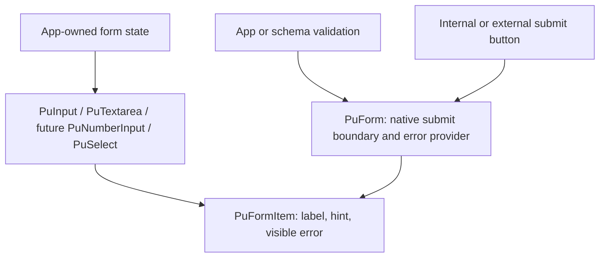
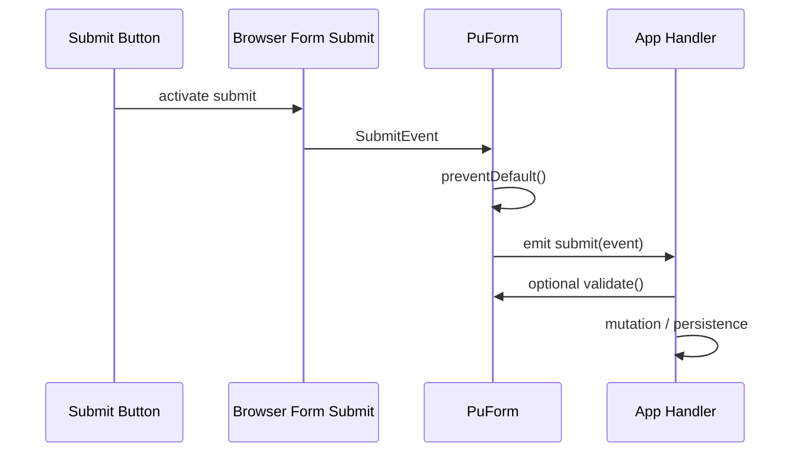

# Capability Inventory

## Status

Draft baseline from repository exploration on 2026-06-14.

## Evidence Read

- `packages/web/AGENTS.md`
- `docs/30-unit-tdd/web/component-contract.md`
- `docs/30-unit-tdd/web/composition-principles.md`
- `packages/web/package.json`
- `packages/web/src/components/puInput/`
- `packages/web/src/components/puTextarea/`
- `packages/web/src/components/puForm/`
- `packages/web/src/components/puFormItem/`
- `packages/web/src/components/puPicker/`
- `packages/web/src/components/puCheckboxGroup/`
- `packages/web/src/stories/forms/PuInput.story.vue`
- `packages/web/src/stories/forms/PuForm.story.vue`
- `F:/CODING/Project/Anana/mvp-HA/tasks/design-web-package-integration/deep-ui-refactor/50-form-capability-needs.md`

## Current Package Baseline

Form structure:

- `PuForm` renders a native `form`, prevents default submit, emits
  `submit(event: SubmitEvent)`, provides error state, and exposes `validate()`.
- `PuFormItem` renders labels, required markers, hints, manual errors, and
  errors injected from `PuForm`.

Text fields:

- `PuInput` supports string-backed single-line fields, `nativeType`, clear,
  password visibility, count, prefix/suffix slots, `size`, `variant`, `tone`,
  and `invalid`.
- `PuTextarea` supports string-backed multiline fields, `autoHeight`, count,
  `size`, `variant`, `tone`, and `invalid`.

Selection and booleans:

- `PuPicker` supports picker/drawer-style option selection.
- `PuCheckbox`, `PuCheckboxGroup`, `PuToggleSwitch`, `PuSegmented`, and
  `PuMultiStopToggle` cover some boolean and compact choice cases.
- There is no first-class `PuRadio`, `PuSelect`, `PuCombobox`, or
  `PuInputGroup` in the current public component set.

## Gap Matrix

| Need | Current state | Gap |
| --- | --- | --- |
| Numeric app state | `PuInput modelValue` is string-only | No ergonomic `number | null` contract |
| Numeric constraints | `nativeType="number"` exists | `min`, `max`, `step` are not public props |
| Date/time constraints | date/time native types exist | constraint forwarding is not documented |
| Web-native select | `PuPicker` exists | Picker interaction is not a general replacement for native select |
| Free-text suggestions | No documented `list`, combobox, or autocomplete | Native datalist usage stays outside package |
| External submit | `PuForm` emits submit | Native `id`/external `form` contract is not explicit |
| Native form attrs | `PuForm` root is a form | `id`, `name`, `autocomplete`, `novalidate`, `action`, `method` are not public props |
| Field accessibility wiring | `PuFormItem` renders label/message; controls expose `invalid` | No automatic `aria-describedby`, message id, or invalid propagation |
| Input icon buttons | `PuInput` renders clear/password/prefix/suffix buttons | Built-in icon buttons do not expose obvious accessible labels |
| Validation meta | `PuForm` injects schema errors | No `validateField`, reset/clear validate, dirty/touched, or trigger contract |
| Radio/select coverage | `PuSegmented` and `PuPicker` cover some cases | No first-class radio group or native dense select |
| Form layout | `PuForm` is mostly structural | No first-class grid, inline-label, section, or input-group layout |
| Textarea sizing | `autoHeight` exists | No `rows`, row bounds, min-height, or resize contract |
| Dirty tracking | `update:modelValue` exists | No committed `change` guidance for admin editors |

## Form Topology

## Submit Sequence

## Design Reading

- The package already made the right boundary move: field chrome belongs in
  `PuFormItem`, while `PuInput` and `PuTextarea` own only field controls.
- The next blocker is value semantics and native behavior, not visual styling.
- Field accessibility should be package-owned where package components render
  labels, messages, and internal icon buttons.
- `PuPicker` should not be stretched into every select use case. Native select
  and combobox behavior deserve their own contracts.
- Full form-state management should stay out of scope for now. The current
  need is better native wiring and field coverage, not a validation framework.
