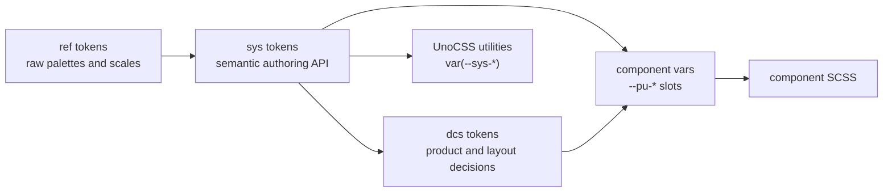

# Token Model

Context:

```
packages/web already has a useful token topology:

ref -> sys -> dcs -> component CSS variables

The rework should preserve that topology while making unit semantics clearer.
```

## Proposed Topology



## Unit Policy

Use rem for:

```
typography size
page and component spacing
shared UI-scale radius values
shared UI dimensions only if the migration audit proves they have real cross-
component semantics
```

Use unitless values for:

```
line-height
font-weight
opacity
z-index
```

Keep px for:

```
1px borders and hairlines
shadow offsets
canvas and cropper output buffers
runtime measured DOM dimensions such as scrollHeight
image intrinsic dimensions
numeric width/height props unless a separate API decision changes them
pill radius sentinel values such as 999px
```

## Spacing Decision

Confirmed:

```
Do not add xxsmall as a public token.
Migrate existing --sys-spacing-xxsmall references to --sys-spacing-xsmall.
```

Proposed spacing scale:

```
xsmall: 0.25rem  // 4px at 16px root
small:  0.5rem   // 8px
medium: 1rem     // 16px
large:  2rem     // 32px
xlarge: 3rem     // 48px
```

Reasoning:

```
The current xlarge equals large. If spacing becomes rem-based, xlarge should
create a real step so it has an independent purpose.
```

## Size Decision

Current issue:

```
sys size mixes control height, icon boxes, and general fixed dimensions. Once
icon-size is removed as a first-class design axis, there may not be enough shared
meaning left to justify a generic --sys-size-* scale.
```

Proposed direction:

```
Do not rename --sys-size-* to control-size by default.
Audit all --sys-size-* usages during migration.
Keep shared size tokens only when multiple components use the same dimension for
the same reason.
Move component-specific dimensions into component vars or local rem/em values.
Do not expand icon-size as a parallel scale unless a component proves a fixed
graphic box is required.
```

Possible shared size scale, only if the audit proves it is still useful:

```

Decision pressure:

```
The current trend points toward removing generic --sys-size-* rather than
renaming it. Component APIs can expose local sizing decisions through --pu-* vars
when needed.
```
xsmall: 1.25rem  // 20px
small:  1.5rem   // 24px
medium: 2rem     // 32px
large:  2.75rem  // 44px
xlarge: 3.75rem  // 60px
```

## Iconfont Policy

Confirmed direction:

```
Most icons are iconfont spans. The preferred sizing model is:

1. assign an appropriate typography token or em-based font-size to the icon span
2. apply padding/gap on the button, chip, cell, or control container
3. align using line-height and flex centering
```

Avoid:

```
Creating separate icon-size tokens as a first-class system unless real icon
containers need fixed boxes independent from text rhythm.
```
